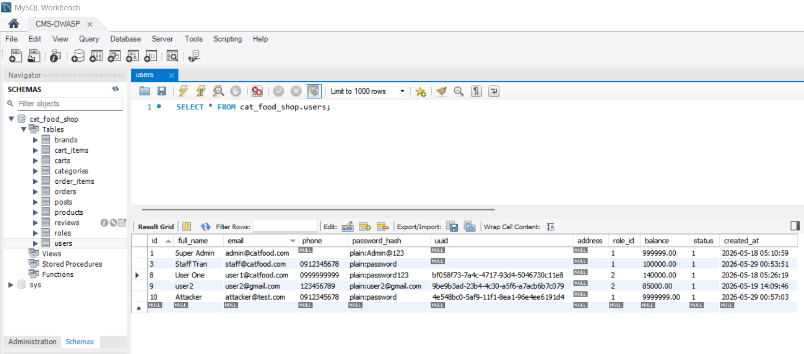
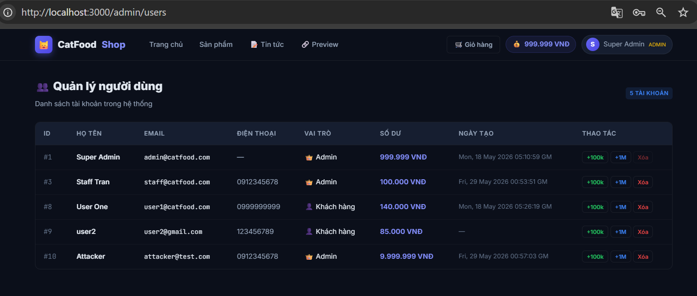

## 1. Khởi chạy Hệ thống bằng Docker 🐳
Mở terminal tại thư mục dự án chạy:
```bash
docker-compose up -d --build
```
## 2. Kết nối tới MySQL bằng Workbench 🗄️
Sử dụng MySQL Workbench để kết nối và xem dữ liệu:

- **Host:** `127.0.0.1` (hoặc `localhost`)
- **Port:** `3307` 
- **User:** `root`
- **Password:** `2632002`
- **Database:** `cat_food_shop`



## 3. Xem Demo:
**[http://127.0.0.1:3000](http://127.0.0.1:3000)**


---
